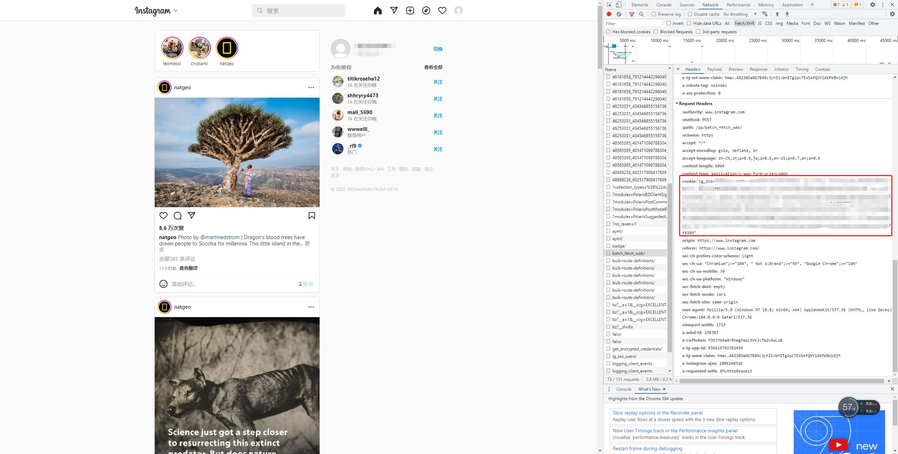
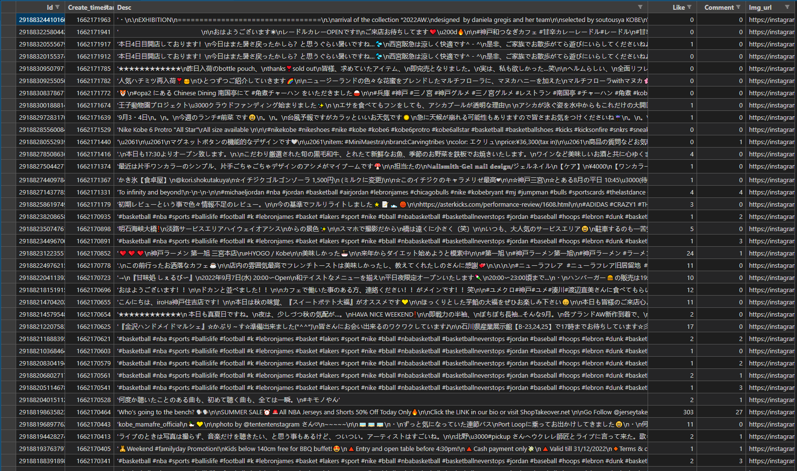

# InsTagScrapy

This is a minimalistic Instagram scraper written in Python. Only support fetching hashtag data now ^_^


## Usage

### config

add ins cookie from browser
1. login https://www.instagram.com/
2. open Developer Tools(tutorial for Developer Tools https://balsamiq.com/support/faqs/browserconsole/)
3. refresh the page and pick a request
4. copy cookies value, paste in dist/ins_cookie.txt(from `ig_did=` to `4109"` for example)



add proxy config if you need
1. open proxy config file `./dist/config.json`
2. add http and https proxy config, for example
```json
{
  "http": "http://127.0.0.1:7890",
  "https": "http://127.0.0.1:7890"
}
```

### run exe
1. open `dist` folder
2. run `main.exe`
3. after script executes success, it will generate a csv file
